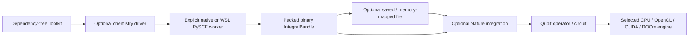

# York toolkit and data flow

`Toolkit` connects separately installed integrations, drivers and simulators.
Its constructor and inventory use only the standard library. The ninth wheel,
`qiskit-aer-york-data`, adds NumPy arrays when data transport is needed; it brings
no circuit framework, chemistry SDK or GPU runtime.



## Install and compose

Packages are not published yet. Install the local projects together:

```text
python -m pip install ./core ./data ./integrations/qiskit ./integrations/nature ./drivers/pyscf ./engines/statevector
```

On Windows, configure an existing WSL Python with PySCF separately. Only the
chemistry calculation uses it; data conversion, mapping and simulation stay on
Windows. On Linux/macOS, explicitly install PySCF in the chosen native worker.

```python
from qiskit_aer_york import Toolkit

toolkit = Toolkit()
print(toolkit.inventory())  # Metadata only; no GPU or chemistry SDK initialization.
integrals = toolkit.driver("pyscf").run_integrals(
    atom="H 0 0 0; H 0 0 0.735", basis="sto3g", runtime="wsl",
    python="/home/your-user/venvs/chemistry/bin/python", distribution="Ubuntu",
)
integrals.save("h2.york")
data = toolkit.integration("data")
reused = data.IntegralBundle.load("h2.york", mmap=True)
nature = toolkit.integration("nature")
problem = nature.from_integrals(reused)
operator = nature.qubit_operator(problem)
simulator = toolkit.simulator("statevector")
# Use problem/operator with a prepared circuit or Qiskit algorithm.
```

`toolkit.molecule("pyscf", **worker_options)` is the short route to a Nature
problem. To select GPU execution, install that engine and pass `"opencl"`,
`"cuda"` or `"rocm"` to `toolkit.simulator(...)`; the molecular data is unchanged.
An unsupported SDK/OS/device fails explicitly. No adapter silently substitutes
another solver or precision. See [platform limits](NATURE_COMPATIBILITY.md) and
[GPU support](accelerators/README.md).

## Integral representation and ownership

The restricted molecular format contains real MO-basis `h1[n,n]` and
`eri_s8[m*(m+1)//2]`, where `m=n*(n+1)//2`. Arrays use contiguous little-endian
float64. Metadata fixes Hartree units, chemist index order, eightfold symmetry,
alpha/beta electron counts, nuclear/reference energies, and driver provenance.
Complex orbitals, unrestricted spin tensors, dipoles and arbitrary driver
properties need additional explicit schemas; they are not inferred or discarded
into this restricted format.

The worker computes packed arrays using PySCF's
[MO transformation conventions](https://github.com/pyscf/pyscf/blob/master/pyscf/tools/fcidump.py).
It writes a versioned JSON header followed by aligned array buffers directly to
binary stdout. The host validates dimensions, checksums, finite values and
scientific conventions, then exposes read-only NumPy views of the received bytes.
Nature wraps the packed ERI in its `S8Integrals` and uses the official
[FCIDump translator](https://github.com/qiskit-community/qiskit-nature/blob/main/qiskit_nature/second_q/formats/fcidump_translator.py)
with an in-memory FCIDump object. Neither side generates/parses FCIDump text or
allocates a dense `n**4` ERI tensor on this path.

Public construction snapshots caller-owned arrays once. Binary decoding of
immutable bytes and read-only memory-mapped files shares the payload; mutable
input is copied before it can affect the bundle. The subprocess pipe and OS still
copy data: this is zero-copy host array decoding, not end-to-end zero-copy IPC.
Metadata access returns an independent JSON snapshot. Release mapped bundles,
Nature tensors and any other array views before deleting/replacing a mapped file
on Windows. `save`/`load` is explicit reuse, with no automatic stale calculation
cache. Generic `read_frame`/`write_frame` also support numeric arrays of specified
dtype/shape for future integrations; object arrays and pickle are excluded.

Existing FCIDump files and legacy `driver.run(format="fcidump")` remain supported.
Nature prefers `run_integrals` when the selected driver offers it. The standalone
worker receives the same encoder source as the host; it requires PySCF/NumPy but
no York, Qiskit or Nature packages. ROHF retains actual spin on both routes.

## Execution reuse

The shared Qiskit adapter reuses verified gate matrices by their actual complex
contents and shape, within one job. The lookup has at most 256 entries; it never
keys a mutable custom gate by its name. Plans retain the matrices they need.
OpenCL/CuPy states additionally reuse at most 32 uploaded gate/target pairs on
their own device/context and precision, with a lower limit when memory is tight.
Device caches end with the state; no context or device pointers cross jobs.

Multiple saves, observables and terminal sampling reuse a host snapshot until a
gate changes the state. Saved result objects retain their own values. Job metadata
reports matrix validations/hits, uploads/hits, and host state transfers so the
benefit can be checked for the actual workload. These caches add bounded lookup
storage; `max_memory_mb` still estimates state working buffers rather than total
process memory. Benefits depend on repeated operations and requested outputs.

## Reproducible evidence

Run `tools/york_data_benchmark.py --output artifacts/data-local.json`. Its 24-orbital
synthetic, dense-in-packed-storage fixture validates both representations against
each other. Initial Windows results:

| Measurement | FCIDump route | Binary route |
| --- | ---: | ---: |
| Payload bytes | 1,818,148 | 366,400 |
| Median warm decode seconds | 0.658 (includes text file write) | 0.000414 (includes validation/checksum) |
| Python-tracked peak bytes | 8,037,201 | 47,884 |

This is about 80% less payload for this synthetic fixture. Small/sparse molecules
can favor text because binary metadata and dense packed zeros have overhead.
Timings exclude SCF, subprocess startup, IPC, file generation and operator mapping;
they do not measure overall chemistry/simulation speed. Tracemalloc is not total
process/GPU memory. CI records per-OS measurements without asserting a speed ratio.

A repeated 100-gate circuit on actual Windows NVIDIA RTX 3060 CUDA and Intel UHD
770 OpenCL used 2 matrix uploads, 98 upload hits, and one host transfer for two
saves plus terminal sampling. Independent random circuit/statevector and Qiskit
primitive tests also passed. AMD hardware remains untested. H2 binary/FCIDump
Hamiltonians matched, with York and PySCF both returning `-1.116998996754004`
Hartree; an open-shell H atom verified ROHF spin and reference energy.
